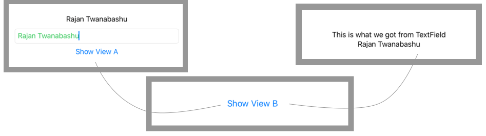

## @EnviromentObject : Sharing data between views

For data that should be shared with all views in your entire app, SwiftUI gives us @EnvironmentObject. This lets us share model data anywhere it’s needed, while also ensuring that our views automatically stay updated when that data changes.Think of @EnvironmentObject as a smarter, simpler way of using @ObservedObject on lots of views. 

Let's assume a scenerio where we take user input from View ParentView and need to pass down through View A and then to view B where we show the user input.  We would have done it via @ObservedObject in view A and View B, then we would have  duplicate code here. With EnvironmentObject we can directly access in view b.



Let create a model Setting 
```swift
class Setting: ObservableObject {
    @Published var name: String = ""
}
```

```swift
struct B: View {
    @EnvironmentObject var setting: Setting
    
    var body: some View {
      VStack{
            Text("This is what we got from TextField")
            Text(setting.name)
        }
    }
}

struct A: View {
    var body: some View {
        NavigationLink(destination: B()) {
            Text("Show View B")
        }
    }
}

struct EnviromentObjectView: View {
    @EnvironmentObject var setting: Setting
    
    var body: some View {
        
        VStack {
            Text(setting.name)
            Group {
                TextField("Enter Name", text: $setting.name)
                    .foregroundColor(.green)
                    .textFieldStyle(RoundedBorderTextFieldStyle())
            }
            NavigationLink(destination: A()) {
                Text("Show View A")
            }
        }.padding()
    }
    
}
```

>To make it work in Swift Preview we would need to pass enviroment object to Preview view as following

```swift
struct DynamicListView_Previews: PreviewProvider {
    static var previews: some View {
        PublishedView()
    }
}

```

> To make it accessible through out the application we need to add following SceneDelegate 's willConnectTo method

```swift

let setting = Setting()
       
// Use a UIHostingController as window root view controller.
if let windowScene = scene as? UIWindowScene {
    let window = UIWindow(windowScene: windowScene)
    window.rootViewController = UIHostingController(rootView: contentView.environmentObject(setting))
    self.window = window
    window.makeKeyAndVisible()
}

```
