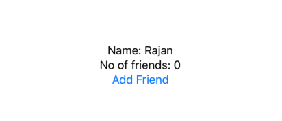

## @Published, @ObservedObject, ObservableObject

Let's assume we have a view that shows the number of friends of a **Person**.  To make it more useful we add a button to add new friend to his list. 

```swift

class Person {
    let name: String = "Rajan"
    var friendsCount: Int = 0
}

struct PublishedView: View {
    var person: Person = Person()
    
    var body: some View {
        VStack {
            Text("Name: \(person.name)")
            Text("No of friends: \(person.friendsCount)")
            Button(action: {
                self.person.friendsCount += 1
            }){
                Text("Add Friend")
            }
        }
        
    }
}

```



Here when we tap on *add friend* nothing happens, that because view is not listining to anything. To listen to change when *friendsCount* we would need following changes.

> mark person object @observedObject in PublishedView

```swift
 @ObservedObject var person: Person = Person()
```

> Then change the friendsCount property of Person class to be @Published  and conform Class to  ObservableObject. That's it.

```swift
class Person: ObservableObject {
    let name: String = "Rajan"
    @Published var friendsCount: Int = 0
}
```


## What is @Published property wrapper

@Published is one of the most useful property wrappers in SwiftUI, allowing us to create observable objects that automatically announce when changes occur. SwiftUI will automatically monitor for such changes, and re-invoke the body property of any views that rely on the data. In practical terms, that means whenever an object with a property marked @Published is changed, all views using that object will be reloaded to reflect those changes.
