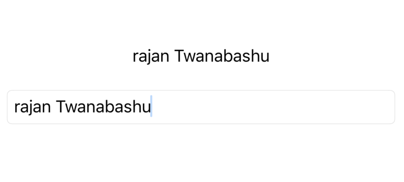

## Understanding @State & @Binding

To understand **@State** and **@Binding** at its simplest form let's look at how TextField in Swift UI Works. 

```swift
struct ParentView: View {
    @State private var name: String = ""
    var body: some View {
        VStack {
            Text(name)
            Group {
                TextField("123", text: $name)
                    .foregroundColor(.black)
                    .textFieldStyle(RoundedBorderTextFieldStyle())
            }.padding(12)
        }
    }
}
```
### Screenshot



> Here ParentView have state properties called name which is bind to TextField, then we are using same state property name to display as a text. This is why when ever we change any text in TextField it is automatically reflected in Text.


### @State
@State persist value of given type through which a view reads and monitor the value.

### @Binding 
@Binding provide a way to mutate value of a @State property in  child view or sub view.


## Uses in Custom View

Let's create a custom view which is actually a fancy form of TextField and we will try to replicate same same behaviour as in TextField. Here we create RTTextField which have @Binding property **text** and is bind to @State *name*  of its parent.  Now when ever we make changes in RTTextField it will be reflected back to Parent Text label.


```swift
struct ParentView: View {
    @State private var name: String = ""
    var body: some View {
        VStack {
            Text(name)
            RTText(text: $name)
        }
    }
}

struct RTText: View {
    @Binding var text: String
    var body: some View {
        Group {
        TextField("", text: $text)
            .foregroundColor(.black)
            .textFieldStyle(RoundedBorderTextFieldStyle())
        }.padding(12)
    }
}

```

